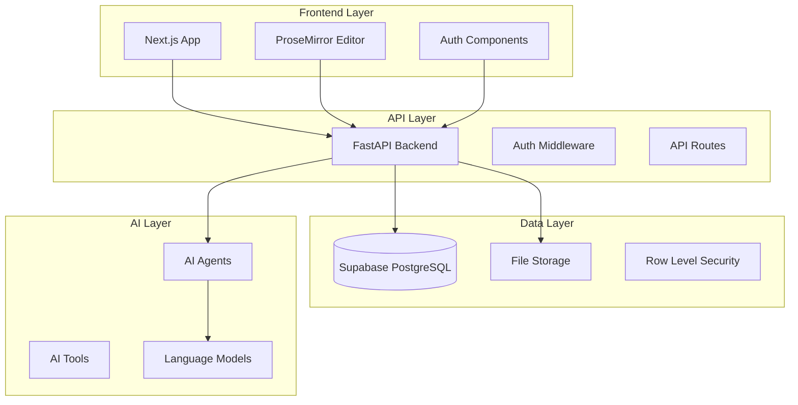

# System Patterns: Knowledge Workspace Platform

## Architecture Overview

### High-Level System Design



## Core Design Patterns

### 1. Multi-Tenant Data Isolation

#### Pattern: Row Level Security (RLS)
- **Implementation**: Supabase RLS policies for tenant isolation
- **Benefits**: Database-level security, automatic filtering
- **Usage**: All tables include `organization_id` with RLS policies

```sql
-- Example RLS Policy
CREATE POLICY "Users can only see their organization's data" 
ON documents FOR ALL 
USING (organization_id = auth.jwt() ->> 'organization_id');
```

#### Pattern: Tenant Context Middleware
- **Implementation**: FastAPI middleware to inject tenant context
- **Benefits**: Automatic tenant filtering, security enforcement
- **Usage**: All API endpoints automatically scoped to tenant

### 2. Document Management Architecture

#### Pattern: Hierarchical Document Structure
```
Organization
├── Team Documents (shared across projects)
│   ├── Templates
│   ├── Guidelines
│   └── Shared Resources
└── Projects
    ├── Project A
    │   ├── Memory Bank Documents
    │   ├── Custom Documents
    │   └── Project Resources
    └── Project B
        └── ...
```

#### Pattern: Document Versioning
- **Implementation**: Event sourcing for document changes
- **Benefits**: Full audit trail, rollback capability
- **Storage**: Document snapshots + change events

#### Pattern: Template System
- **Base Templates**: Memory Bank structure (projectbrief.md, etc.)
- **Custom Templates**: Team-specific document structures
- **Dynamic Templates**: AI-generated based on project type

### 3. AI Agent Integration

#### Pattern: Agent Registry
```typescript
interface AIAgent {
  id: string;
  name: string;
  description: string;
  capabilities: string[];
  isPublic: boolean;
  organizationId?: string;
  configuration: AgentConfig;
}
```

#### Pattern: Tool Execution Framework
- **Sandboxed Execution**: Isolated environment for AI tools
- **Permission System**: Granular permissions for agent actions
- **Audit Trail**: Log all agent actions and decisions

#### Pattern: Context-Aware AI
- **Document Context**: AI agents have access to project documents
- **User Context**: Personalized based on user role and history
- **Team Context**: Shared knowledge and preferences

### 4. Real-Time Collaboration

#### Pattern: Operational Transformation (OT)
- **Implementation**: ProseMirror collaborative editing
- **Conflict Resolution**: Automatic merge of concurrent edits
- **State Synchronization**: WebSocket-based real-time updates

#### Pattern: Presence Awareness
- **User Cursors**: Show where team members are editing
- **Activity Feed**: Real-time updates on document changes
- **Notification System**: Contextual alerts and mentions

## Data Models

### Core Entities

#### Organizations (Multi-Tenant Root)
```typescript
interface Organization {
  id: string;
  name: string;
  slug: string;
  settings: OrganizationSettings;
  createdAt: Date;
  updatedAt: Date;
}
```

#### Users & Roles
```typescript
interface User {
  id: string;
  email: string;
  name: string;
  avatar?: string;
  createdAt: Date;
}

interface OrganizationMember {
  userId: string;
  organizationId: string;
  role: 'owner' | 'admin' | 'member' | 'viewer';
  joinedAt: Date;
}
```

#### Projects & Documents
```typescript
interface Project {
  id: string;
  organizationId: string;
  name: string;
  description?: string;
  settings: ProjectSettings;
  createdBy: string;
  createdAt: Date;
}

interface Document {
  id: string;
  organizationId: string;
  projectId?: string; // null for team-wide documents
  title: string;
  content: ProseMirrorDoc;
  type: 'memory_bank' | 'custom' | 'template';
  templateId?: string;
  createdBy: string;
  createdAt: Date;
  updatedAt: Date;
}
```

## Security Patterns

### 1. Authentication & Authorization

#### Pattern: JWT + RLS
- **Authentication**: Supabase Auth with JWT tokens
- **Authorization**: Database-level RLS + API-level checks
- **Session Management**: Secure token refresh flow

#### Pattern: Role-Based Access Control (RBAC)
```typescript
enum Permission {
  READ_DOCUMENTS = 'read:documents',
  WRITE_DOCUMENTS = 'write:documents',
  MANAGE_PROJECTS = 'manage:projects',
  MANAGE_TEAM = 'manage:team',
  USE_AI_AGENTS = 'use:ai_agents',
  MANAGE_AI_AGENTS = 'manage:ai_agents'
}
```

### 2. Data Protection

#### Pattern: Encryption at Rest
- **Database**: Supabase built-in encryption
- **File Storage**: Encrypted file uploads
- **Sensitive Data**: Additional encryption for AI agent configs

#### Pattern: Audit Logging
- **User Actions**: All CRUD operations logged
- **AI Agent Actions**: Detailed logs of agent decisions
- **Security Events**: Authentication, authorization failures

## Performance Patterns

### 1. Caching Strategy

#### Pattern: Multi-Level Caching
- **Browser**: React Query for client-side caching
- **API**: Redis for frequently accessed data
- **Database**: Supabase connection pooling

#### Pattern: Document Loading
- **Lazy Loading**: Load document content on demand
- **Prefetching**: Anticipate user navigation patterns
- **Incremental Updates**: Only sync changed content

### 2. Scalability Patterns

#### Pattern: Horizontal Scaling
- **API**: Stateless FastAPI instances
- **Database**: Supabase auto-scaling
- **File Storage**: CDN for static assets

#### Pattern: Background Processing
- **AI Agent Execution**: Async task queue
- **Document Processing**: Background content analysis
- **Notifications**: Async delivery system

## Integration Patterns

### 1. External API Integration

#### Pattern: Adapter Pattern
```typescript
interface ExternalIntegration {
  authenticate(): Promise<void>;
  syncData(type: string): Promise<void>;
  webhook(event: WebhookEvent): Promise<void>;
}

class GitHubIntegration implements ExternalIntegration {
  // Implementation
}
```

### 2. AI Model Integration

#### Pattern: Provider Abstraction
```typescript
interface AIProvider {
  generateText(prompt: string, context: DocumentContext): Promise<string>;
  analyzeDocument(content: string): Promise<DocumentAnalysis>;
  suggestContent(partial: string): Promise<string[]>;
}
```

## Development Patterns

### 1. API Design

#### Pattern: RESTful + GraphQL Hybrid
- **REST**: Standard CRUD operations
- **GraphQL**: Complex queries and real-time subscriptions
- **OpenAPI**: Auto-generated documentation

#### Pattern: Error Handling
```typescript
interface APIError {
  code: string;
  message: string;
  details?: Record<string, any>;
  timestamp: Date;
}
```

### 2. Testing Strategy

#### Pattern: Test Pyramid
- **Unit Tests**: Business logic and utilities
- **Integration Tests**: API endpoints and database
- **E2E Tests**: Critical user workflows
- **AI Tests**: Agent behavior and accuracy

This system architecture provides a solid foundation for building a scalable, secure, and maintainable knowledge workspace platform.
